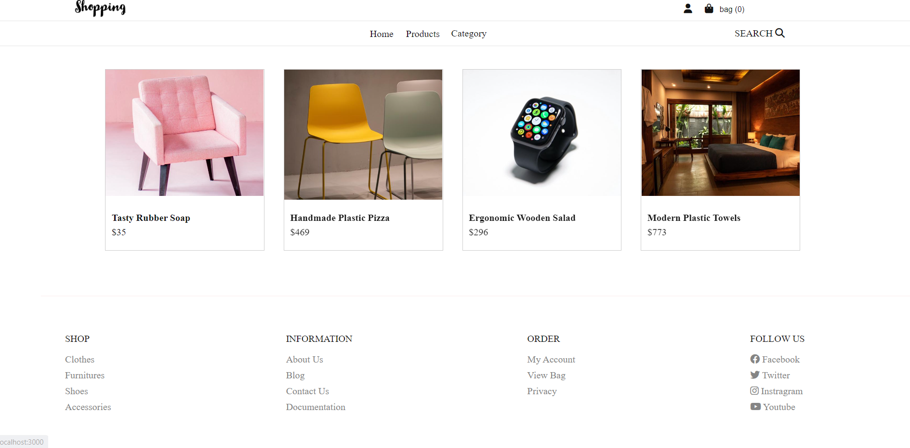

# Front-end Project


## Table of Content

- [Live Demo](#Live-Demo)
- [Current Features](#Current-Features)
- [Technologies](#Technologies)
- [Project Structure](#Project-Structur)
- [Future Work](#Future-Work)
- [Requirement](#Requirement)
- [Getting Started](#Getting-Started)
- [Result](#Result)

### Live Demo

- (https://fs133-fullstack.netlify.app)

### Current Features

- SignUp
- Login
- Product Page
- Product Details Page
- Search by Title
- Get Products by Category
- Add products to the Cart
- Get AllUsers
- Profile Page
- Create Product Page

### Technologies

- HTML5
- SCSS
- React and Redux-Toolkit
- React Portal
- Typescript
- Subscribe method to persist Cart data and user data
- Good platform for Logo design (https://express.adobe.com/express-apps/logo-maker/)

### Project Structure

```
   src
    ├───assets
    ├───common
    ├───components
    │   ├───Cart
    │   ├───Drawer
    │   ├───Footer
    │   ├───Header
    │   ├───Home
    │   ├───Routes
    │   ├───Search
    │   ├───types
    │   │   ├───auth
    │   │   ├───drawer
    │   │   ├───header
    │   │   ├───products
    │   │   └───ui
    │   └───Ui
    ├───css
    ├───hooks
    ├───pages
    │   └───admin
    ├───redux
    │   ├───actions
    │   └───slices
    └───scss
        ├───features
        ├───sections
        │   ├───cart
        │   ├───dashboard
        │   ├───home
        │   └───product
        └───shared
            ├───inheritances
            └───variables
```

### Future Work

- Refactor the code.
- Improve the Ui design.
- Using Custom Hook
- React Helmet for Document Header
- Create some reusable components passing through props
- Restructure the project
- Order page implementation
- Role Based Authorization
- Adding Proper Error Validation
- Unit testing (jest)

## Instruction to start the project

In the project directory, you can run:

### `npm install`

Install all the dependencies

### `npm start`

Runs the app in the development mode.\
Open [http://localhost:3000](http://localhost:3000) to view it in the browser.

The page will reload if you make edits.\
You will also see any lint errors in the console.

### `npm test`

Launches the test runner in the interactive watch mode

### `npm run build`

Builds the app for production to the `build` folder.\
It correctly bundles React in production mode and optimizes the build for the best performance.

### Result

#### `Home-Page`





#### `Signup-Login`


#### `Product-page`


#### `Cart-page`


#### `Profile-page`


#### `ProductList-page`


#### `ProductList-page`


#### `CreateProduct-page`


[Introduction](../APIEndpoint.md)
